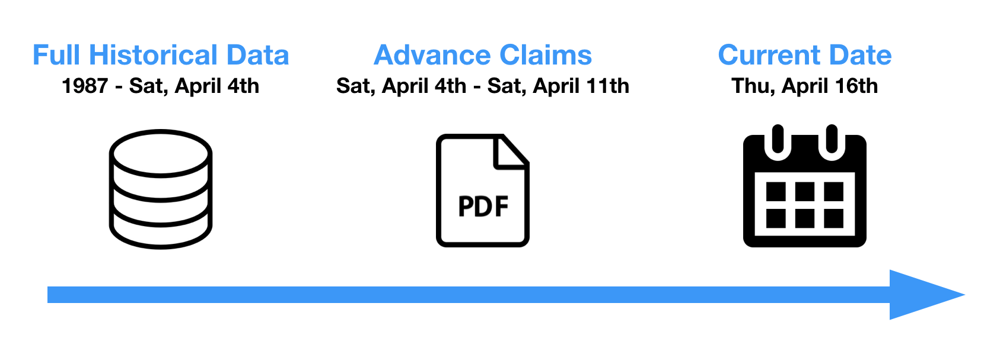
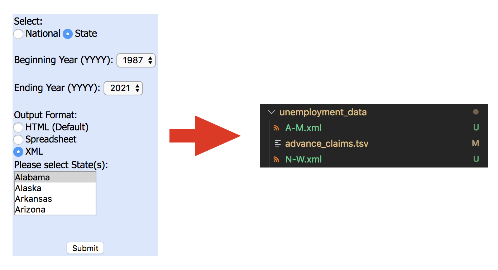
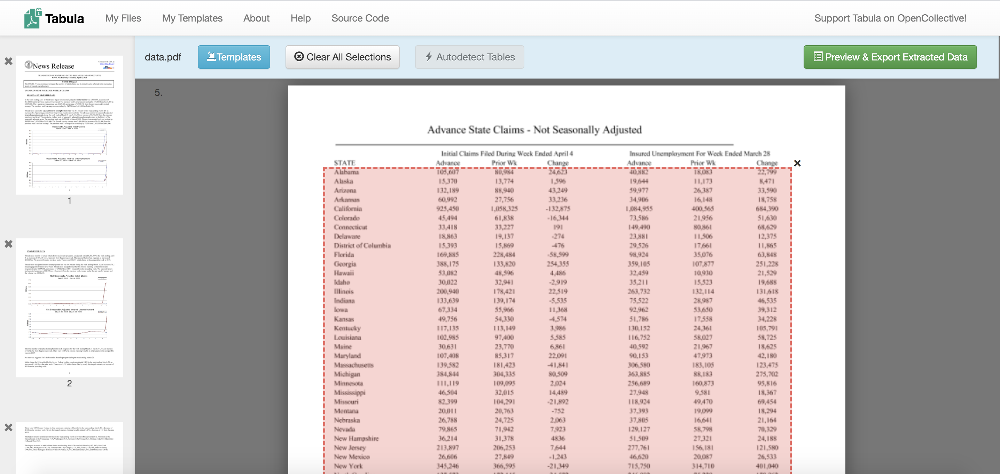
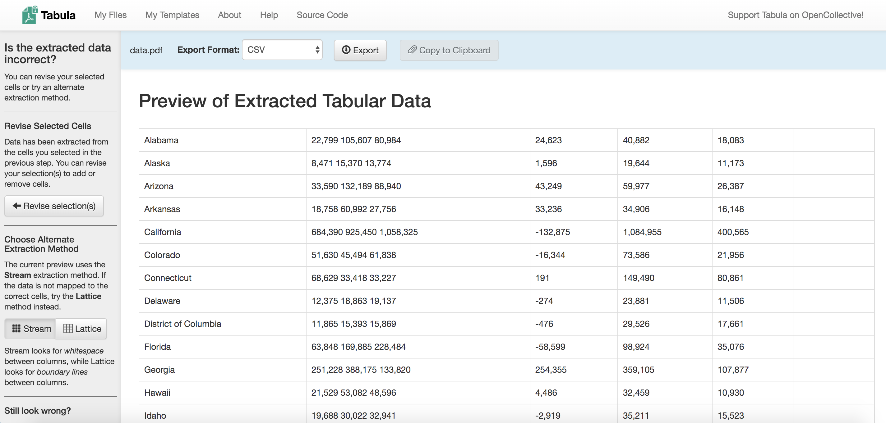
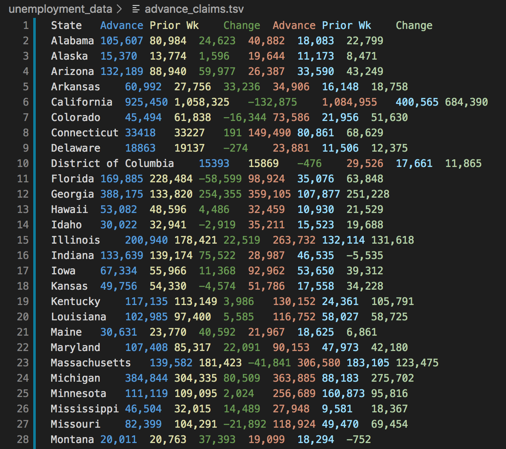
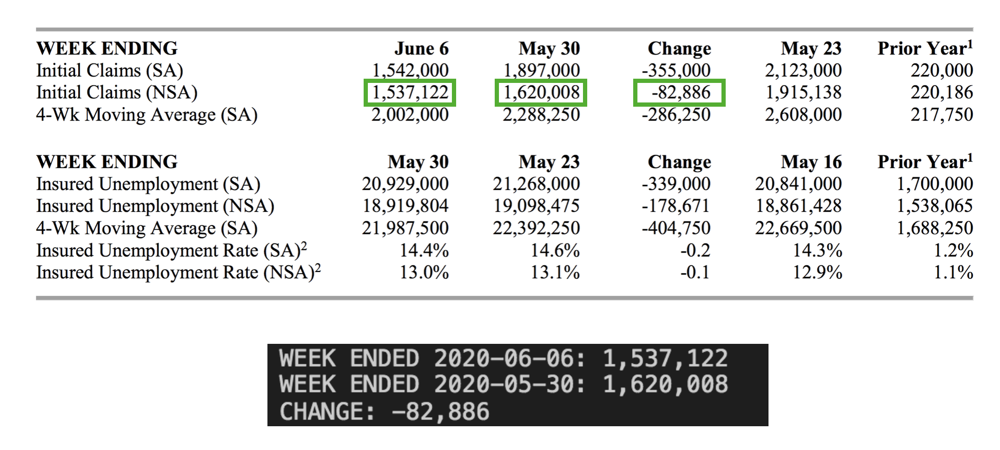
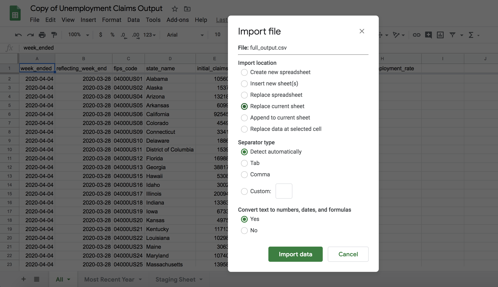

# Unemployment Insurance Claims ETL Process

## Overview

The Unemployment Insurance Claims data is provided by the Employment & Training Administration of the US Department of Labor on a weekly basis. Each Thursday their database is updated to show full data from one week before the last Saturday, and around 8:30 am Boston Time, they release a report where we can get advance claims data until last Saturday. 

If we take April 16th as an example, we'll notice the database has data until April 4th, and the released PDF file will have the advance claims entries until April 11th.



The full historical data in the database reports `Initial Claims`, `Continued Claims`, `Covered Employment` and `Insured Unemployment Rate`. The PDF doesn't have the last two columns, so I fill them with `NaN`, the values for the advance claims are reviewed and completed the next week.

The goal of this ETL process is to update the database every Thursday, adding the PDF advance claims and store everything on a Google Sheet that doubles as an API endpoint, used to generate the visualizations on DataUSA's front end.

## Setting up a local environment (just one time)

1. Clone the repository.
2. Create a Python virtual environment and activate it: 
```
virtualenv -p python3 py3
source py3/bin/activate
```
3. Install the necessary packages:
```
pip install -r requirements.txt
```

## Step 1: Download new database information

All database files should be inside a folder called `unemployment_data`, you need to create it if it's not there. You will find the database here: https://oui.doleta.gov/unemploy/claims.asp

You need to check `State`, beginning year `1987`, ending year `2021` and the output format as `XML`. After that you can select a group of states and download the generated files to the `unemployment_data` folder. The first file (`A-M.xml`) should have states from `Alabama` to `Montana`, and the second one (`N-W.xml`) from `North Carolina` to `Wyoming`. You can select multiple states at once using `Shift + Down`.



## Step 2: Running the pipeline

The bamboo pipeline will parse the XML files, tidy the data and then generate a CSV output file called `partial_output.csv` inside the `unemployment_output/` folder. With your Python virtual environment activated you can run:
```
python unemployment_pipeline.py
```
If you have any issue here, check that only the correct XML files are being processed.

**Note**: It's not the objective of this repository, but you can load the result of this pipeline to a local database instance if you set up a connection on `conns.yaml` correctly and make `ingest: True` on the pipeline script.

## Step 3: Getting data from the PDF file

The latest data will be available at https://www.dol.gov/ui/data.pdf, you need to install `Tabula` to process the PDF file and extract the table with the advance claims, you can get it here: https://tabula.technology/

Once you install Tabula, it will ask you to import the PDF, and then you can click on `Autodetect Tables`, you need to make sure that only the `Advance State Claims - Not Seasonally Adjusted` table is selected by Tabula, if it's not, you can select the area of the table manually. 



If you click on `Preview & Export Extracted Data` you will see the result, it's usually really messy. In the following output, we can see the following problems:
* Three columns are presented together when they shouldn't.
* The columns have changed places, for some reason the `Change` column is now the first one, moving the rest to the right.
* Some rows aren't aligned with the columns.
* Some country names have a `*` character that must be removed.
* The column names were not considered on Tabula so the extraction can be easier, so they need to be added manually.
* The last row, corresponding to the `US Total` value must be removed as well.

**Note:** There could be other issues with the Tabula output, so you're free to find the best way to generate the TSV file.



You can extract the data in the desired format, and then you need to modify the values manually so you can get a tidy TSV file. Personally, I like to extract as CSV, import the resulting file to a Google Sheet and clean it with the help of the `=SPLIT()` function. After that you need to save the file as TSV and put it in the `unemployment_data/` folder as `advance_claims.tsv`. The final TSV file must look like this:



It's good practice to check different values against the PDF, at least three countries with any column, to make sure there are no errors before concatenating the files.


## Step 4: Running the second pipeline

If your TSV file has any quirks, you can edit the first function on `advance_claims.py` so it can be cleaned properly, the file will open and clean the TSV file, then it will concatenate with the `partial_output.csv` file, generating `full_output.csv`. If you don't have any more changes to make to the function, you can just run:
```
python advance_claims.py
```

## Step 5: Validate the output file against the PDF

You can find a summary of the unemployment insurance data for regular state programs on the PDF file. The Python script `summary.py` will find the aggregation for each week and you can compare against the `Initial Claims (NSA)` row of the summary. To run the script you have to change the last week of information on the variable `last_week` and then do:
```
python summary.py
```
You can check the output of the script with the row on the PDF summary:



If everything's okay, you can move to the next step.


## Step 6: Importing data to the Google Sheet/API Endpoint

This step requires extra care so as not to delete the endpoint sheet. You can access the sheet here: https://docs.google.com/spreadsheets/d/19SRb_CXUyNGj5xUtc6xnwtHLfBmmWJpHVnmsGv1JdUc/edit#gid=134214696

You can see there are three sheets: `All`, `Most Recent Year` and `Staging Sheet`, you ONLY need to work on `All`and the other sheets will update automatically. Carefully follow the next steps:

1. Place yourself on the A1 cell of `All`.
2. Click on `File` > `Import` > `Upload` and select the `full_output.csv` file you generated.
3. Mark `Replace current sheet`, change nothing else and press `Import Data`. WARNING: Make sure the `Replace current sheet` option is selected or you'll replace the whole file and break the endpoint.



After that, the `Most Recent Year` sheet will update itself, because it depends on a query from the `All` sheet. And the process will be completed.


## Optional: Monitoring the PDF release

You can set up a `watch` to monitor the release of the updated PDF file on Thursdays around 8:30 am Boston Time, you can use any method on your command line, I use this command, to check if the file was released every 10 seconds:

```
watch -n 10 "curl -s -v -X HEAD https://www.dol.gov/ui/data.pdf 2>&1 | grep -e '^< last-modified:' -e '^< expires:' -e '^< date:'"
```

**Note**: If you have any questions don't hesitate to contact me on mauricio@datawheel.us or Slack.